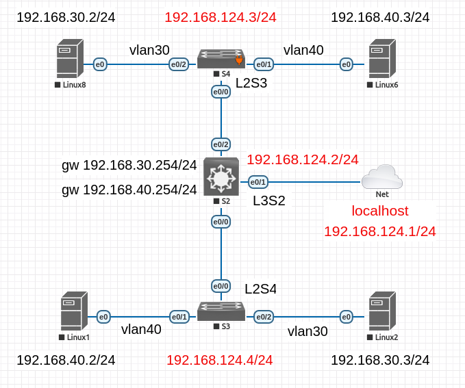

### Configure VLAN on Cisco switches with Ansible

The schema of three Cisco Switches and four Alpine Linux machines running on the EVE-NG



Network Cloud - Net on the schema is localhost machine with ip address 192.168.124.1/24.

On all Linux machines, disabled DHCP ip address assignment and enabled a static setup

For example on the Vlan30 192.168.30.2/24 machine it would be

`localhost# ./setup-network.sh -n vlan30-1 -p 192.168.30.2 -m 24 -g 192.168.30.254`

and make the same on all Linux machines

#### Enable SSH connection to the switches

All commands running on the L3 switch L3S2 on the schema

```
enable
configure terminal
```

Create a user and generate rsa keys for remote connection

How many bits can get from localhost machine

```
localhost# cat /etc/crypto-policies/back-ends/openssh.config | grep RSAMinSize
RSAMinSize 2048
```
continue

```

hostname L3S2
username admin privilege 15 secret secret
ip domain-name l3s2.net
ip ssh version 2
crypto key generate rsa
How many bits in the modulus [512]: 2048
```

enable the possibility of remote connection

```

line vty 0 4
login local
transport input ssh
loggin synchronous

```


set an ip address on the virtual interface to connect with

```

interface vlan 1
ip address 192.168.124.2 255.255.255.0

```

#### Check the remote connection to the switches

Add link to the inventory.yaml in the $HOME/.ansible.cfg

`localhost$ echo "inventory = $PWD/inventory.yaml" >> $HOME/.ansible.cfg `

Run ansible-playbook to get the switches os version for example with cisco.ios_command module

```

localhost$ ansible-playbook version.yaml
PLAY [Ping switches] ******************************************************************************************************************

TASK [Get version] ********************************************************************************************************************
ok: [192.168.124.2]
ok: [192.168.124.4]
ok: [192.168.124.3]

TASK [Output version] *****************************************************************************************************************
ok: [192.168.124.3] => {
    "version_output.stdout_lines": [
        [
            "version 15.1"
        ]
    ]
}
...............

```
#### Enable VLANs on the switches

Create vlans with cisco.ios.ios_vlans module

File create-vlans.yaml

```
---
- hosts: switch
  name: Setup vlans
  gather_facts: false
  tasks:
  - name: Enable vlans on the all switches
    cisco.ios.ios_vlans:
      config:
      - name: Vlan30
        vlan_id: 30
        state: active
        shutdown: disabled
      - name: Vlan40
        vlan_id: 40
        state: active
        shutdown: disabled
```

run it

```
ansible-playbook create-vlans.yaml 

PLAY [Setup vlans] ********************************************************************************************************************

TASK [Enable vlans on the all switches] ***********************************************************************************************
ok: [192.168.124.2]
ok: [192.168.124.4]
ok: [192.168.124.3]

PLAY RECAP ****************************************************************************************************************************
192.168.124.2              : ok=1    changed=0    unreachable=0    failed=0    skipped=0    rescued=0    ignored=0   
192.168.124.3              : ok=1    changed=0    unreachable=0    failed=0    skipped=0    rescued=0    ignored=0   
192.168.124.4              : ok=1    changed=0    unreachable=0    failed=0    skipped=0    rescued=0    ignored=0 
```

#### Confugure L3 switch

Make interfaces point to the L2 switches mode trunk and create a virtual 

interfaces to route ip packets with dot1q tag with cisco.ios.config module

File setup-L3.yaml

```
- hosts: L3
  name: Setup main switch
  gather_facts: false
  tasks:
    - name: Enable trunk on ports
      cisco.ios.config:
        lines:
          - interface range Ethernet0/0, Ethernet0/2 
          - switchport trunk encapsulation dot1q
          - switchport mode trunk
    - name: Config L3 switch to route vlan's packets
      cisco.ios.config:
        lines:
          - interface vlan 30 
          - ip address 192.168.30.254 255.255.255.0
          - no shutdown
          - interface vlan 40
          - ip address 192.168.40.254 255.255.255.0
          - no shutdown
          - ip routing

```

run it

```
ansible-playbook setup-L3.yaml 

PLAY [Setup main switch] **************************************************************************************************************

TASK [Enable trunk on ports] **********************************************************************************************************
[WARNING]: To ensure idempotency and correct diff the input configuration lines should be similar to how they appear if present in the
running configuration on device
changed: [192.168.124.2]

TASK [Config L3 switch to route vlan's packets] ***************************************************************************************
changed: [192.168.124.2]

PLAY RECAP ****************************************************************************************************************************
192.168.124.2              : ok=2    changed=2    unreachable=0    failed=0    skipped=0    rescued=0    ignored=0 
```

#### Configure L2 switches

Make interfaces point to L3 switch mode trunk, and interfaces point to the Linux machines mode access, and set

VLANs on these. Allowed all VLANs to include VLAN 1 for SSH connectivity.

file setup-L2.yaml

```
- hosts: L2
  gather_facts: false
  tasks:
  - name: Enable trunk mode on E0/0 interface
    cisco.ios.ios_config:
      lines:
        - interface Ethernet 0/0
        - switchport trunk encapsulation dot1q
        - switchport mode trunk
        - switchport trunk allowed vlan 1,30,40
  - name: Config vlans on interfaces L2 switches
    cisco.ios.ios_config:
      lines: 
        - interface Ethernet 0/1
        - switchport mode access
        - switchport access vlan 40
        - interface Ethernet 0/2
        - switchport mode access
        - switchport access vlan 30

```

run it

```
ansible-playbook setup-L2.yaml

PLAY [L2] *****************************************************************************************************************************

TASK [Enable trunk mode on E0/0 interface] ********************************************************************************************
[WARNING]: To ensure idempotency and correct diff the input configuration lines should be similar to how they appear if present in the
running configuration on device
changed: [192.168.124.3]
changed: [192.168.124.4]

TASK [Config vlans on interfaces L2 switches] *****************************************************************************************
changed: [192.168.124.4]
changed: [192.168.124.3]

PLAY RECAP ****************************************************************************************************************************
192.168.124.3              : ok=2    changed=2    unreachable=0    failed=0    skipped=0    rescued=0    ignored=0   
192.168.124.4              : ok=2    changed=2    unreachable=0    failed=0    skipped=0    rescued=0    ignored=0 
```

#### Save changes

Make changes permanent with a copy from running-config to the startup-config

File save-vlans.yaml

```
---
- hosts: switch
  name: Setup vlans
  gather_facts: false
  tasks:
  - name: Save changes into startup-config
    cisco.ios.ios_config:
      lines:
        - do write
        # or - do copy running-config startup-config

```

run it

```
ansible-playbook save-vlans.yaml 

PLAY [Setup vlans] ********************************************************************************************************************

TASK [Save changes into startup-config] ***********************************************************************************************
[WARNING]: To ensure idempotency and correct diff the input configuration lines should be similar to how they appear if present in the
running configuration on device
changed: [192.168.124.2]
changed: [192.168.124.3]
changed: [192.168.124.4]

PLAY RECAP ****************************************************************************************************************************
192.168.124.2              : ok=1    changed=1    unreachable=0    failed=0    skipped=0    rescued=0    ignored=0   
192.168.124.3              : ok=1    changed=1    unreachable=0    failed=0    skipped=0    rescued=0    ignored=0   
192.168.124.4              : ok=1    changed=1    unreachable=0    failed=0    skipped=0    rescued=0    ignored=0
```

#### Check VLANs working

Ping from the VLAN 30 host to the host on the VLAN 40

```
vlan30-1:~# ping -c 3 192.168.40.2
PING 192.168.40.2 (192.168.40.2): 56 data bytes
64 bytes from 192.168.40.2: seq=0 ttl=63 time=6.025 ms
64 bytes from 192.168.40.2: seq=1 ttl=63 time=7.042 ms
64 bytes from 192.168.40.2: seq=2 ttl=63 time=8.294 ms

```
